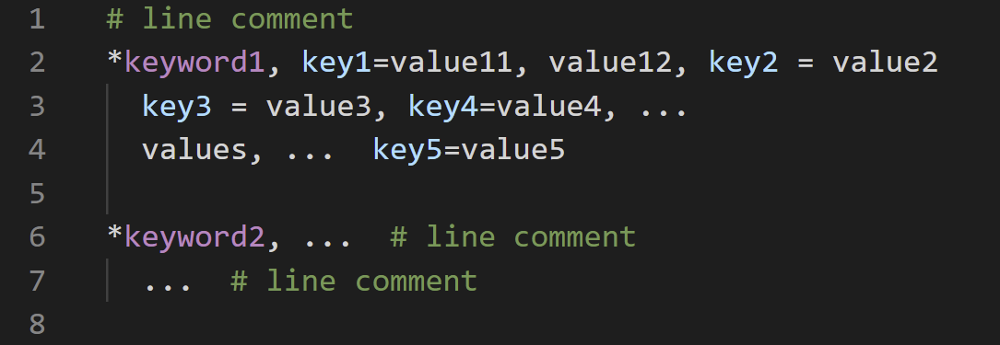

# README

Syntax highlight for free format input.

## Features

- line comment marker: **#**

- keyword marker: **\***

- key indicator: **=** in key=value

## Requirements

There is no requirement.

## Extension Settings

Currently, no additional setting is provided.

## Known Issues

- Indentation after keyword line is not working.

- Unindentation before keyword line is not working.

## Release Notes

### 1.0.1

- Addition of screen shot in readme.

- Addition of icon.

### 1.0.0

- Initial release of free format input.
